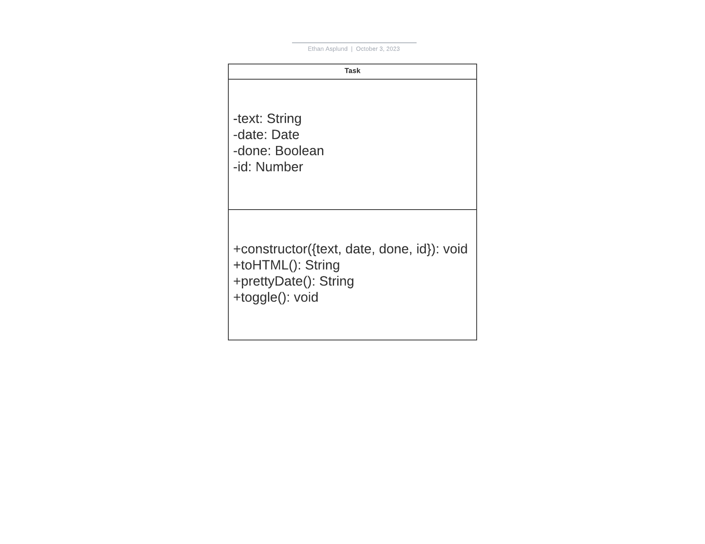
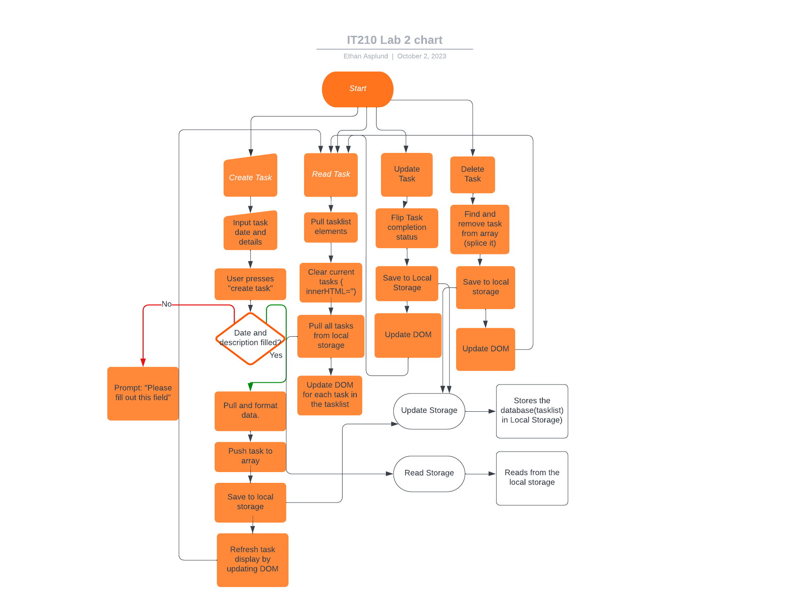

# IT210 Lab 2 Writeup
## Introduction
Ethan Asplund  
October 2 2023  
Lab 2
## Executive Summary
On this lab, I created a tasklist website using HTML, CSS, and JavaScript. It follows the content and styling we created in lab 1. This app lets people create, read, update, and delete tasks while also storing the data persistently in local storage. 

## Design Overview

Requirements:
- Add task with given date
- Store task information in local storage
- Toggle task completion status
- Delete task

The first thing I did for this lab was create the "Task" class. This class provides the framework for the formatting that would be displayed onto the website. Each task has text, a date, an ID, and a boolean called 'done.'

*UML Class Overview. Displays attributes along with the class methods which include the toHTML which formats an entry into HTML, prettyDate which changes the date to a localized format, and toggle which shows if a task is complete or not*

After this, I implemented the CRUD functions. These functions are essential for manipulating the DOM and their functionalities and connections are displayed here:
 
*UML Activity Diagram for the CRUD functions* 

After these were implemented, the site looked like this:

 *Task created and applied to the webpage*

*Task crossed out*

*'Hello' task deleted*

### *File Descriptions*
- index.html: Contains the main structure of the website, including the form to create tasks and the task display section.
- script.js: Houses the JavaScript logic for CRUD operations, DOM manipulation, and interaction with local storage.
- style.css: Provides the styling details for the website.

## Questions

1. What are two differences and similarities between JavaScript and a previous language you have used (e.g. C++ or Python)? (Think of differences and similarities that are more unique to these 2 languages, not all languages in general.)

- Javascript is dynamically typed. This is similar to python, but different to a language like C++ that requires manual type declaration.

- Javascript--like python--is a higher level interpreted language, and doesn't require direct memory management and pointers like C++

2. What is the difference between JSON and JavaScript objects?

- JSON stands for javascript object notation. It's readable but also easy to parse. Data is represented in key value pairs and can be converted in javascript objects with ease.

- Javascript objects are just instances of classes that function like any other language

- The difference between the two is that JSON is a string format that looks like an object, but an object is a part of the language which has methods and properties

3. If you open your web page in two different browsers, will changes on one appear on the other? Why or why not?

- No, the information on a website goes to local storage which is exclusive to person's browser. The only way a change can appear on another user's end is if you're performing operations that communicate with the webserver and allow another user to fetch that information

4. How long did you spend on this lab?
- I spent about 4-5 hours on it. It didn't take me long to code up the Task class and CRUD functions, but I was confused on how to get it linked up to the HTML file properly.

## Lessons Learned

1. Calling update tasks instead of read tasks when loading the page

I called the wrong function when starting my website. Instead of calling readTasks() I called updateTask(). The issue with this is that updateTasks doesn't pull from localstorage when you startup the page, so everything came up blank. readTasks clears current tasks and pulls them in from local storage which is what I actually wanted.

2. Setting up redirect for port 443 broke the website

When I set up the CNAME for this website, I had some issues getting the server to work correctly. For instance, when I changed the redirect on the config file for port 443, it completely broke the website for some reason. My issue came from a misunderstanding of the difference between the DNS name and the CNAME. I set up the configuration to redirect to the name of the DNS, but since the configuration was made to redirect a given CNAME, it was calling the DNS as a CNAME which was never created.

3. Task duplication

When I added a new task, it would duplicate the previous one. This is because the function readTasks() wasn't clearing the clearing the current tasks before reading and displaying the new one. Once I simply cleared the HTML on my declared variable which held the tasklist, it worked.

## Conclusions
- Manipulate the Document Object Model (DOM) using JavaScript.
- Create, read, update, and delete data in local storage.
- Pass data using the JSON format.
- Develop an activity diagram to visually represent processes.
- Set up website on AWS with DNS, A NAME, and CNAME
- Set up redirect to port 443 to establish TLS via HTTPS

## References
https://www.w3schools.com/js/js_json_intro.asp

https://www.w3schools.com/js/js_htmldom.asp

https://developer.mozilla.org/en-US/docs/Web/javascript

https://developer.mozilla.org/en-US/docs/Web/JavaScript/Guide/Working_with_objects

https://www.w3schools.com/howto/howto_js_todolist.asp

https://developer.mozilla.org/en-US/docs/Web/API/Document/getElementById

https://www.w3schools.com/js/js_htmldom_elements.asp

https://stackoverflow.com/questions/10306129/javascript-get-element-by-name

